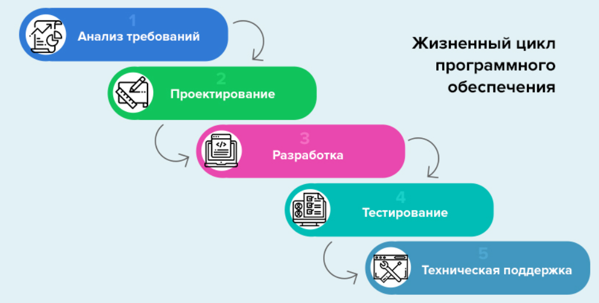
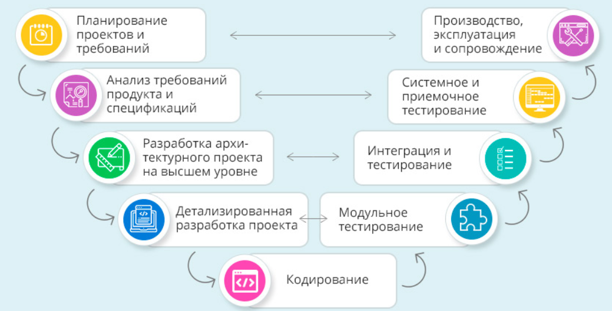

## Модели разработки ПО ##
---

Для того, чтобы лучше понимать соотношение тестирования с программированием и другими видами проектной деятельности, важно знать и различать модели разработки ПО. 

**Модель разработки** ПО (_Soft ware Development Model, SDM_) — структура, систематизирующая различные виды проектной деятельности, их взаимодействие и последовательность в процессе разработки ПО. Выбор  модели зависит от масштаба
и сложности проекта, предметной области, доступных ресурсов и множества других
факторов.
С.Куликов в своей книге "Тестирование ПО. Базовый курс" пишет:
> "Знать и понимать модели разработки ПО необходимо затем, чтобы уже с первых дней работы понимать, что происходит вокруг, что, зачем и почему вы делаете. Многие начинающие тестировщики отмечают, что ощущение бессмысленности происходящего посещает их, даже если
текущие задания интересны. Чем полнее вы будете представлять картину происходящего на
проекте, тем яснее вам будет виден ваш собственный вклад в общее дело и смысл того, чем вы
занимаетесь."

Классическими моделями считают:
+ Водопадную
+ V-образную
+ Итерационную инкрементальную
+ Гибкую (Agile)
+ Спиральную

Также существуют раздельно итерационная, инкрементальная модели и "RAD (Rapid Application Development)" модель, как разновидность инкрементальной. [Подробнее в этой статье Хабр.](https://habr.com/ru/company/edison/blog/269789/).

У других авторов в классификацию добавляются модели _"Code and fix"_,  _"Chaos model"_, _прототипная_.  

[ISTQB Foundation Level Syllabus](https://www.istqb.org/downloads/send/2-foundation-level-documents/281-istqb-ctfl-syllabus-2018-v3-1.html) разделяет все модели на две обобщающие категории:
+ Последовательные модели
+ Итерационные инкрементальные модели

Принципиально то, что в последовательной ("водопадной") модели все виды проектной делятельности (анализ требований, проектирование, программирование, тестирование и т.д.) выполняются последовательно один за другим. В отличие от, например, V-образной модели, где применяют Принцип раннего тестирования, и каждой стадии разработки соответствует свой уровень тестирования. 

Рассматривая подробнее гибкие методологии, в частности **Scrum**, можно сказать, что они опираются на итеративную разработку. В Scrum такие итерации называются _спринтами_. Ценности _Agile Manifest_ напрямую применяются в Scrum: 
+ Люди и их взаимодействия важнее процессов и
инструментов
+ Работающий продукт важнее исчерпывающей
документации
+ Сотрудничество с заказчиком важнее обсуждения условий
контракта
+ Реакция на изменения важнее следования плану

В свою очередь Srcrum создает и опирается на следующие ценности:
+ Фокус (сосредотачиваясь на ограниченном количестве вещей в единицу времени, мы эффективнее сотрудничаем и быстрее достигаем поставленных результатов)
+ Смелость (имея поддержку команды, мы получаем смелость браться за более сложные задачи)
+ Открытость (в ходе коммуникаций мы практикуемся открыто доносить своё положение дел, опасения, что помогает нам разрешать озвученные проблемы)
+ Обязательство (поскольку у нас больше контроля над тем, что происходит, мы чувствуем большую ответственность за результат)
+ Уважение (поскольку мы тесно сотрудничаем в командах, делим наши успехи и неудачи, мы учимся взаимоподдержке и уважению).

Scrum - это командный процесс, который включает в себя три роли:
+ Scrum Master 
+ Product Owner 
+ Team

За успех Scrum в проекте отвечает **Scrum Master** и является связующим звеном между менеджментом и командой. 

Обязанности _Scrum Master_ :
+ Создает атмосферу доверия
+ Участвует в митингах
+ Устраняет препятствия
+ Делает проблемы и открытые вопросы видимыми
+ Отвечает за соблюдение практик и процесса в команде

Скрам Мастер ведёт Daily Scrum Meeting и отслеживает прогресс команды при помощи
Sprint Backlog, отмечая статус всех задач в Sprint.

**Product Owner** - это человек, отвечающий за разработку продукта. Как правило, это
product manager для продуктовой разработки, менеджер проекта для внутренней
разработки и представитель заказчика для заказной разработки.

Обязанности _Product Owner_ таковы:
+ Отвечает за формирование видения продукта
+ Управляет ROI
+ Управляет ожиданиями заказчиков и всех заинтересованных лиц
+ Координирует и приоритизирует Product backlog
+ Предоставляет понятные и тестируемые требования команде
+ Взаимодействует с командой и заказчиком
+ Отвечает за приемку кода в конце каждой итерации

Product owner принимает окончательные решения для команды в проекте. Также он ставит задачи команде, но не в праве ставить задачи конкретному члену команды в Спринте.

Команда **(Team)**. Важно, что команда в Scrum является самоорганизующейся и самоуправляемой. Она берет на себя обязательства по выполнению объема
работ на спринт перед Product Owner. Работа команды оценивается как работа единой
группы. Вклад отдельных членов проектной команды не оценивается, так как
это разваливает самоорганизацию команды.

Размер команды ограничивается количеством людей, способных эффективно сотрудничать лицом к лицу, и, как правило, составляет 7+-2 человека.

Обязанности _Команды_ таковы:
+ Отвечает за оценку элементов бэклога
+ Принимает решение по дизайну и имплементации
+ Разрабатывает софт и предоставляет его заказчику
+ Отслеживает собственный прогресс (вместе со Скрам Мастером).
+ Отвечает за результат перед Product Owner

**Артефактами** в Scrum являются _Product backlog_ и _Sprint backlog_.

_Product backlog_ это приоритезированный список имеющихся на данный момент
бизнес- и технических требований к системе. Product Backlog постоянно
пересматривается и дополняется, меняются приоритеты. За Product Backlog отвечает Product Owner.
Он также работает совместно с командой для того, чтобы получить приблизительную оценку сложности и необходимого времени на выполнение, исходя из чего более точно расставляет приоритеты. 

В _Sprint Backlog_ входит функциональность, выбранную Product Owner из Product
Backlog. Все функции разбиты по задачам, каждая из которых оценивается командой.
Каждый день команда оценивает объем работы, который нужно проделать для
завершения задач.

Как сказано выше, **Sprint** в Скраме называют итерацию, длительность которой, как правило, составляет 1-4 недели. Длительность Sprint не может быть продлена. 

Результатом Sprint является готовый продукт _(build)_, который можно передать или хотя бы показать заказчику.

Короткие спринты обеспечивают быстрый feedback проектной команде от заказчика.
Заказчик получает возможность гибко управлять scope системы, оценивая результат
спринта и предлагая улучшения. Такие улучшения попадают в Product Backlog, приоритезируются наравне с прочими требованиями и могут быть запланированы на следующий Спринт.
Можно сказать, что каждый спринт представляет собой маленький "водопад". В течение спринта
делаются все работы по сбору требований, дизайну, кодированию и тестированию
продукта.

**Планирование спринта (Sprint Planning Meeting)** происходит в начале новой итерации
Спринта. На новый Спринт выбираются задачи проекта, обязательства по выполнению
которых за спринт принимает на себя команда. На основе выбранных задач создается
резерв спринта. Каждая задача оценивается в поинтах. Обсуждается и определяется,
каким образом будет реализован этот объем работ. Длительность такого совещания зависит от длительности Спринта и опыта команды.

**Ежедневное совещание (Daily Scrum meeting)** должно начинается точно вовремя и длиться не
более 15 минут. В течение совещания каждый член команды отвечает на 3 вопроса:
+ Что сделано с момента предыдущего ежедневного совещания?
+ Что будет сделано с момента текущего совещания до следующего?
+ Какие проблемы мешают достижению целей спринта?

**Ретроспективное совещание (Retrospective meeting)** проводится после завершения
спринта. Члены команды высказывают своё мнение о прошедшем спринте.
Отвечают на два основных вопроса:
+ Что было сделано хорошо в прошедшем спринте?
+ Что надо улучшить в следующем?
Выполняют улучшение процесса разработки (решают вопросы и фиксируют удачные
решения). Ограничена одним—тремя часами.

**KANBAN** представляет собой другую методологию управления разработкой в семействе Agile.
KANBAN вырос из метолологии _lean-manufactoring (бережливое производство)_, который использовался на заводах Toyota в 1950х. 

Он подразумевает распределение маленьких/небольших задач между сотрудниками и этапами разработки.
Для визуализации задач в Канбан используются _доски со стикерами_, ну или электронные доски.

Доска делится на столбцы, где каждому соответствуют различные этапы разработки, а на стикерах записываются задачи (начиная оформлением идей, заканчивая выпуском продукта).
Между столбцами задачи(стикеры) переходят по столбцам слева-направо поочередно. Над каждым из столбцов может быть зафиксировано ограниченное количество задач которые могут в нем находиться, что позволяет нагружать команду одним и тем же количеством определенного размера задач и вести разработку непрерывно, при этом иметь визуальное представление, насколько команда загружена, не перегружать ее сверхмеры и не давать простаивать. Кажому такому столбцу соответствуют _статусы_, классически это:
+ to do
+ in progress
+ done

или другие практики именования статусов, например: 
+ backlog
+ ready
+ coding
+ testing
+ approval
+ done

Соотвественно задачи переходят из статуса в статус последовательно слева направо, а по мере их выполнения в доску добавляют новые задачи из бэклога. 

Если в статусе In progress находится максимальное количество задач, то все усилия команды концентрируются на этих задачах, для того, чтобы освободить место для новых, тем самым обеспечив поток из статуса в статус.  

КАНБАН - это в первую очередь визуализация, которая помогает быстро увидеть проблемные места, оптимизировать рабочий процесс, обеспечить прозрачность (все могут видеть, кто чем занят).

Существенными отличиями KANBAN от Scrum является то, что:
+ Здесь команды не кроссфункциональны, т.е. команда разработки занимается своими задачами, команда тестирования своими.
+ Отсутствует разделение на роли, как в Scrum. KANBAN имеет две основные роли. Это менеджер (настраивает процесс, заполняет бэклог, расставляет приоритеты, контролирует задачи In progress, для того, чтобы не скапливалось большое количество незавершенной работы) и команда разработки (непосредственно выполняет задачи).
+ Не тратится большое количество времени на митинги.
+ Отсутствуют спринты и какие-либо таймбоксы, команда выполняет задачи от начала до завершения, и задача готова тогда, когда она готова.
